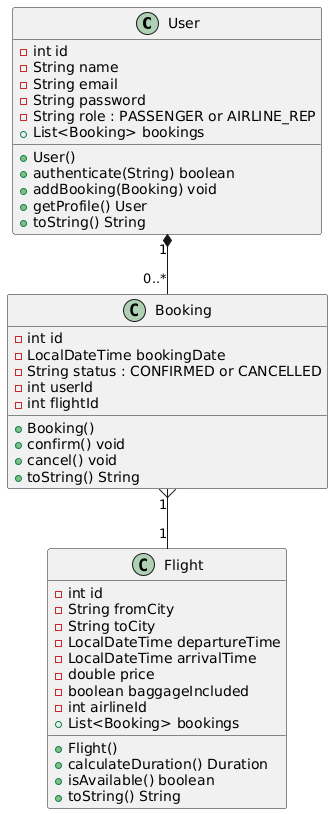

# Диаграмма классов

## Глоссарий

| Понятие     | Описание                                                                 |
|-------------|--------------------------------------------------------------------------|
| **User**    | Класс пользователя: поля - ID, имя, email, пароль, роль; коллекция - бронирования. Методы: аутентификация, управление профилем. |
| **Flight**  | Класс рейса: поля - ID, города from/to, времена, цена, багаж; коллекция - бронирования. Методы: проверка доступности. |
| **Booking** | Класс брони: ID, дата, статус, связи с user/flight. Методы: подтверждение/отмена. |