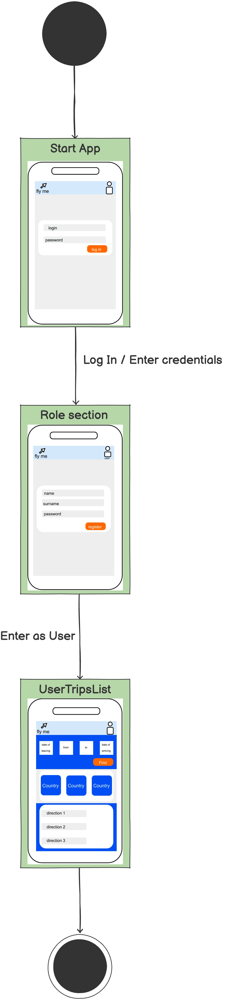
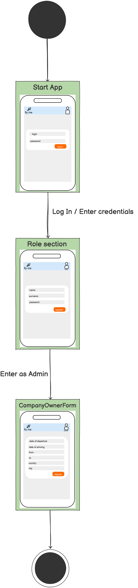
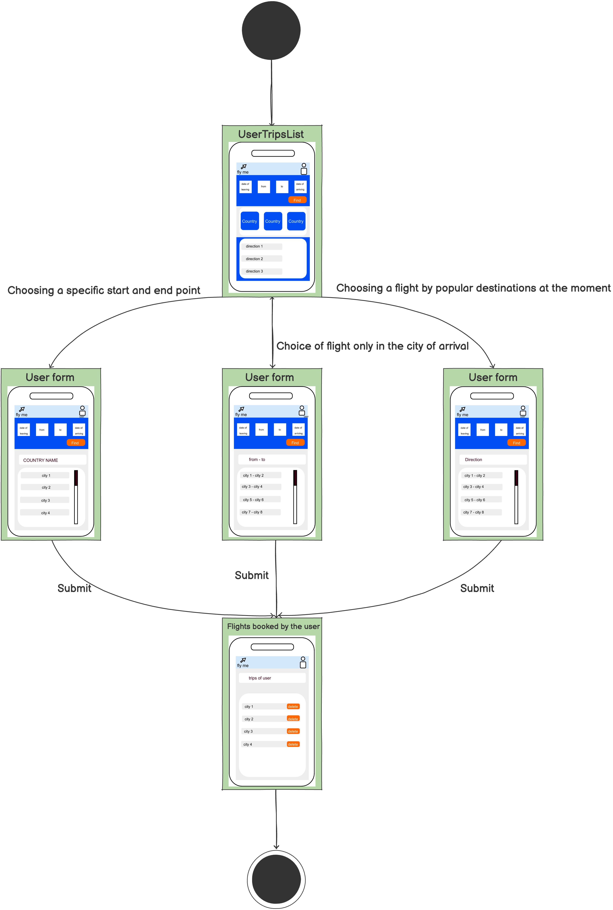

# Диаграмма состояний

# Содержание
1. [Аутентификация и выбор роли пользователя](#1)
2. [Аутентификация и выбор роли администратора](#2)
3. [Выбор рейса](#3)

### 1. Аутентификация и выбор роли пользователя

### 2. Аутентификация и выбор роли администратора

### 3. Выбор рейса

