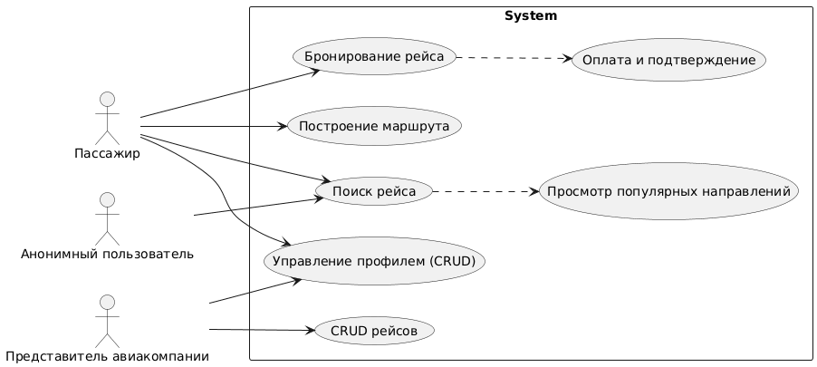

# 📘 Диаграмма вариантов использования — Fly me to the moon!

## 📚 Глоссарий

| Термин          | Определение                                                                 |
|-----------------|-----------------------------------------------------------------------------|
| **Пользователь**| Зарегистрированный пассажир или представитель авиакомпании.                |
| **Рейс**        | Сущность с from/to, временем, ценой; доступен для поиска/брони.             |
| **Бронь**       | Запись о бронировании рейса пользователем.                                 |
| **Маршрут**     | Пользовательский путь на основе рейсов.                                    |

---

# 📑 Содержание

1. [Актёры](#1)
2. [Варианты использования](#2)  
   2.1 [Поиск рейса](#2.1)  
   2.2 [Бронирование рейса](#2.2)  
   2.3 [Управление профилем (CRUD)](#2.3)  
   2.4 [Построение маршрута](#2.4)  
   2.5 [CRUD рейсов](#2.5)  
   2.6 [Просмотр популярных направлений](#2.6)  
   2.7 [Оплата и подтверждение](#2.7)

---

## 🎭 1. Актёры

| Актёр                    | Описание                                                                  |
|--------------------------|---------------------------------------------------------------------------|
| **Пассажир**             | Основной пользователь: ищет, бронирует рейсы.                             |
| **Анонимный пользователь**| Просматривает рейсы без регистрации.                                      |
| **Представитель авиакомпании** | Добавляет/редактирует рейсы.                                              |

---

## 🎬 2. Варианты использования

### 2.1 Поиск рейса

**Описание:** Поиск по одному/двум параметрам (SRS 3.1.1). Мокап: "Выбор полёт по городу прилёта".  
**Предусловия:** На главной странице.

**Основной поток:**
- Пользователь вводит город отправления/прибытия, дату.
- Система запрашивает рейсы (API /search).
- Отображается список с фильтрами (цена, время).
- Пользователь видит детали (мокап "Общий вид сайта").

**Альтернативный поток А1:** Нет результатов — показать популярные (UC6).

### 2.2 Бронирование рейса

**Описание:** Создание брони после поиска.  
**Предусловия:** Аутентифицирован (мокап "Вход как зарегистрированный").

**Основной поток:**
- Выбрать рейс, заполнить пассажирские данные.
- Оплатить (интеграция, но упрощенно).
- Сохранить бронь, отправить email.
- Обновить профиль (мокап "Забронированные авиаперелёты").

**Альтернативный поток А2:** Мест нет — альтернативы.

### 2.3 Управление профилем (CRUD)

**Описание:** Редактирование профиля. Мокап: "Создание нового пользователя".  
**Предусловия:** Вход (UC вход/выход).

**Основной поток:**
- Просмотр/редактирование email, пароля.
- Просмотр броней.
- Сохранить изменения.

### 2.4 Построение маршрута

**Описание:** Прокладывание пути (SRS 3.1.1).  
**Основной поток:**
- Выбрать несколько рейсов.
- Система соединяет в маршрут.
- Сохранить/забронировать.

### 2.5 CRUD рейсов

**Описание:** Для Rep. Мокап: "Добавление нового маршрута".  
**Предусловия:** Роль Rep.

**Основной поток:**
- Добавить/редактировать/удалить рейс.
- Валидация (время future).
- Обновить список.

**Альтернативный поток А3:** Отмена — без сохранения.

### 2.6 Просмотр популярных направлений

**Описание:** Рекомендации. Мокап: "Выбор полёта по направлениям, популярным".  
**Основной поток:**
- Автозагрузка на главной.
- Переход к поиску.

### 2.7 Оплата и подтверждение

**Описание:** Финал брони. Мокап: "Подтверждение бронирования" (интеграция с платежной формой).  
**Предусловия:** Выбран рейс для брони (из UC2.2).

**Основной поток:**
- Система перенаправляет на платежный шлюз (интеграция с Stripe/PayPal, упрощенно — форма с картой).
- Пользователь вводит данные карты, подтверждает оплату.
- При успехе система изменяет статус брони на "CONFIRMED", генерирует PDF-билет и отправляет на email.
- Пользователь перенаправляется в профиль с обновленным списком броней (мокап "Забронированные авиаперелёты").
- Система уведомляет представителя авиакомпании (push/email).

**Альтернативный поток А4:**
- Оплата отклонена — статус "PENDING", предложение альтернативных методов или рейсов (возврат к UC2.1).
- Прерывание — возврат к корзине без оплаты.
